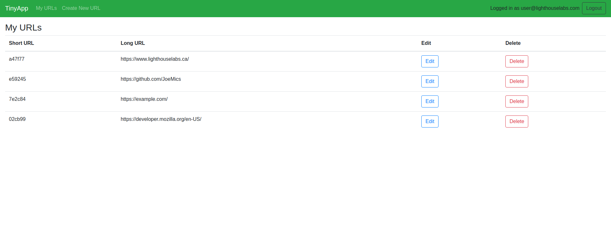
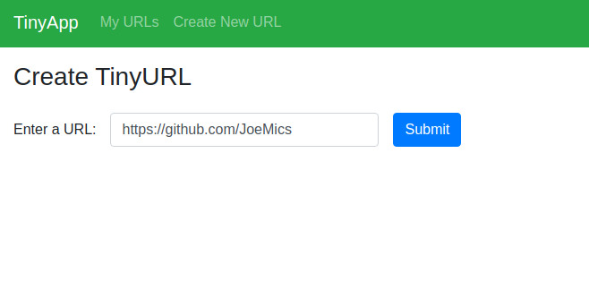
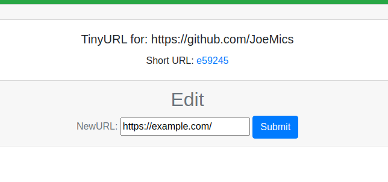

# TinyApp Project

TinyApp is a full stack web application built with Node and Express that allows users to shorten long URLs (à la bit.ly).

## Final Product






## Dependencies

- Node.js
- Express
- EJS
- bcrypt
- body-parser
- cookie-session

## Getting Started

- Install all dependencies (using the `npm install` command).
- Run the development web server using the `node express_server.js` command.

## Usage

To create tiny URLs, you must first register for an account with an email and password.

```
The tiny URLs follow this syntax:

http://localhost8080/u/(6-digit-short-URL)

```

### Example:
```
http://localhost8080/u/a47f77
```
will redirect the the client to
```
https://www.lighthouselabs.ca/
```

## Note:
This project was created as a part of the [Lighthouse Labs](https://www.lighthouselabs.ca/) Web Development Bootcamp. It is intended for educational purposes only.